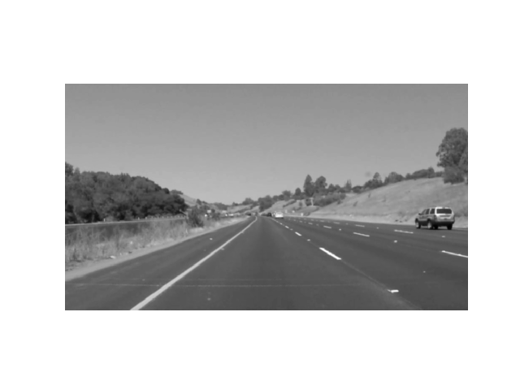
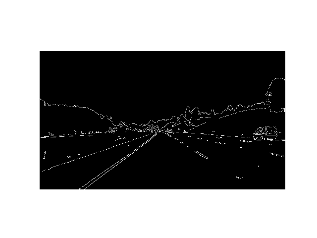
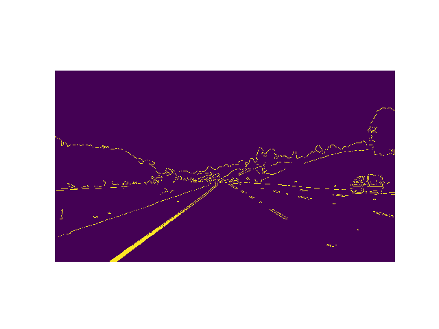
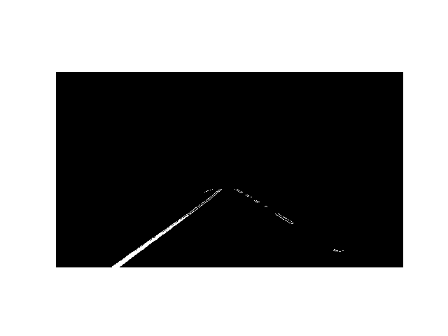
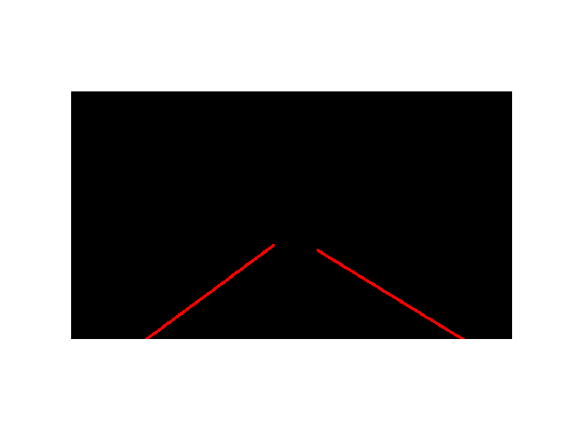
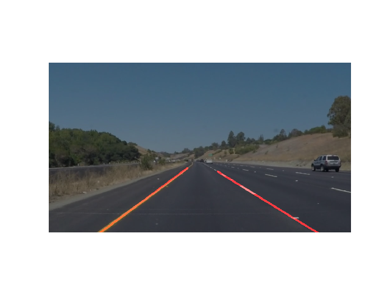

# Project-1: Lane Line Finding

***This repository contains the final code using the knowledge gained in the above tests combined together. If you see the results below, I combine all the images generated at each step and form the final filtered image. The results are for different images which have different lane colors and conditions.***


# Requirements

* Python 3.5 or above
* Numpy
* Matplotlib
* OpenCV
* glob (optional)


# Usage

**1. Run from Command Line**

Clone the project using the following command using Git Bash.

```
git clone https://github.com/anujdutt9/Self-Driving-Car-Nano-Degree.git
```

This will place the main folder in your current directory. This directory contains the code direcories for all individual steps used in the final project. Finally, the directory "Project-1-Lane-Line-Finding" contains the complete project.

To run the code for images, use the following command from command line:

```
python main.py images
```

To run the code for videos, use the following command from command line:

```
python main.py videos
```

For any help related to commands, use:

```
python main.py help
```

**2. Using IPython Jupyter Notebook**

Clone the repository using the following command:

```
git clone https://github.com/anujdutt9/Self-Driving-Car-Nano-Degree.git
```
This will place the main folder in your current directory. This directory contains the code direcories for all individual steps used in the final project. Finally, the directory "Project-1-Lane-Line-Finding" contains the IPython Jupyter Notebook as "P1.ipynb".

If you don't have Jupyter notebook installed, use:

```
pip install jupyter notebook
```

To run the jupyter notebook, open command prompt, navigate to the project directory which has the IPython notebook and type:

```
jupyter notebook
```
A web page opens up and you should see your python files. In these file, find and open the file "P1.ipynb". This should open up the IPython Notebook. 

To run the code, click on the first block and click " Shift Enter ". As you keep on pressing that, the python code goes on executing step by step.

# Project Pipeline

The project is set up as follows:

```
Project-1-Lane-Line-Finding
|_ main.py
|_ utils.py
|_ __init__.py
|_ P1.ipynb
|_ test_images
|_ test_videos
|_ OutputImages
|_ OutputVideos
```

**1. main.py**

This file contains the main pipeline for the Lane Line Detection. The pipeline consists of the following steps:

**a). Read Image**

This reads in all the images in the "test_images" directory one by one and sends them as input to the "LaneLinesPipeline" which in turn returns the images with the lane lines in red color.


**b). GrayScale**

The next step is to convert the colored image to grayscale image. This step is required as we need to detect the lane lines and they can be of any color i.e. yellow or white. So converting to grayscale brings the image to same scale and helps in terms of detection of Lane Lines.


**c). Gaussian Blurring**

Once we obtain the grayscale image, we need to reduce the extra noise from the image. So, for that we use Gaussian Blur on the grayscale image. Gaussian Blurring/filtering is done by convolving each point in the input array with a Gaussian kernel and then summing them all to produce the output array. As a result, we get the smoothed image at the output. The variable to be varied for this is the "Kernel Size". For my case, I have taken the Kernel Size as "5". The most commonly used values for the kernel are 3,5 and 7.



**d). Canny Edge Detection**

Now that we have reduced the noise from the input images, we need to find the edges in the images. This step is important as we get the edges for all the things in the image including the lane lines. Hence, using this, we can get lane line edges of any color lane lines. Now, we need to make sure that we only take the edges that represent the lane lines most accurately and clearly as compared to any other thing in the image. Hence, we use the "lower_threshold" and "upper_threshold" values to set the perfect range in which we get the best lane line edges in image. The values of the threshold ranges from 0 to 255.



**e). Yellow Lane Color Masking (cv2.bitwise_or)**

Now that we have got the edges of the lane lines, it is very simple to get the lane lines and draw a red line on them showing that they have been detected correctly. Well, not that easy. It seems that the pipeline does a great work in recognizing the white lane lines but when it comes to the yellow lane lines, even though we have the edges from the canny edge detection step, sometimes the yellow lanes are misclassified. So, to avoid that and make our pipeline more robust, we have added an additional step i.e. yellow lane color masking.



What this does it that when we get the edges for the lanes in the image, this function performs an "OR" operation of that image with the original input image with the color thresholds set for yellow color. This step helps us to recognize the yellow lane lines more robustly.

**f). Finding & Selecting Region of Interest**

Now, since the image with the edges contains a lot of other edges as well i.e. the edges for the road signs, roadside railings etc., we need to remove them so that we only focus on the lane lines and nothing else. For this, we create a polynomial "Region of Interest". This regio of interest is basically a quadrilateral with four sides. These sides are specifically chosen so that the final image only has the lane lines and nothing else. 



**g). Hough Transform and Filtering**

Now that we have our yellow and white lane lines detected successfully, it's time to draw the lane lines on top of the original image and showcase that. Here comes a concept of RGB and HSV coordinates system. A line in a RGB system is equivalent to a point in the HSV system and vice versa. So, taking the hough transform of the image with lane lines in region of interest, we try to form the complete lines. We take the lines from that image, convert them to coordinates in the HSV system. So now we get a lot of coordinates for all lines in the image. We take in these coordinates and use an averaging system with slope constraints that provides us with the coordinates that might represent the lane lines. Then we pass all thesse coordinates into a "Polynomial Interpolation" function that outputs a line on the image that passes through all the coordinate points in the HSV coordinate system. Using this, we finally get our lane lines in our color of choice.



**h). Weighted Image with Final Lane Lines**

Finally after all these steps are done, we just take the lines generated in the previous step and draw them on the original input image. The final output looks something like this.



**2. utils.py**

This file contains all the functions described above in the pipeline.

**NOTE**: This same pipeline is applied to the videos. The videos are processed frame by frame. Each frame can be considered as an image. Hence, the pipeline works the same for all the videos. 

# Results

**a) Image Pipeline Outputs:**

**1. Image-1:**


**2. Image-2:**

 

**3. Image-3:**


**4. Image-4:**

 

**5. Image-5:**


**6. Image-6:**


**b). Video Pipeline Outputs:**

**1. Solid White Lane Lines**

[](https://www.youtube.com/watch?v=3CvsBqUm-Ho)

**2. Solid Yellow Lane Lines**

[](https://www.youtube.com/watch?v=6aMb8gTh0ZY)

**3. Challenge Video**

[](https://www.youtube.com/watch?v=Kgct7p7SR-w)
