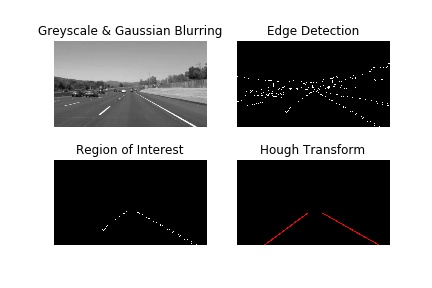
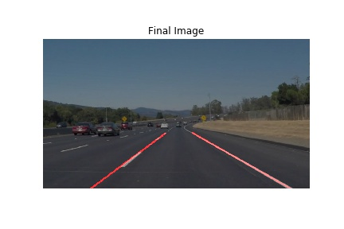
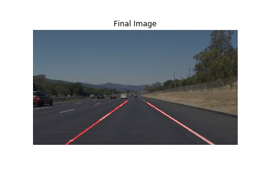
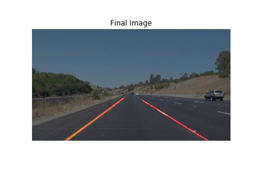
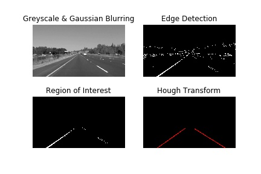

# Project-1: Lane Line Finding

***This repository contains the final code using the knowledge gained in the above tests combined together. If you see the results below, I combine all the images generated at each step and form the final filtered image. The results are for different images which have different lane colors and conditions.***


# Requirements

* Python 3 +
* Numpy
* Matplotlib
* OpenCV
* glob (optional)


# Usage

* Run from Command Line:

***1.*** Clone the project using the following command using Git Bash.

```
git clone https://github.com/anujdutt9/Self-Driving-Car-Nano-Degree.git
```

This will place the main folder in your current directory. This directory contains the code direcories for all individual steps used in the final project. Finally, the directory "Project-1-Lane-Line-Finding" contains the complete project.

To run the code for images, use the following command from command line:

```
python main.py images
```

To run the code for videos, use the following command from command line:

```
python main.py videos
```

For any help related to commands, use:

```
python main.py help
```

***2.*** IPython Jupyter Notebook

Clone the repository using the following command:

```
git clone https://github.com/anujdutt9/Self-Driving-Car-Nano-Degree.git
```
This will place the main folder in your current directory. This directory contains the code direcories for all individual steps used in the final project. Finally, the directory "Project-1-Lane-Line-Finding" contains the IPython Jupyter Notebook as "P1.ipynb".

If you don't have Jupyter notebook installed, use:

```
pip install jupyter notebook
```

To run the jupyter notebook, open command prompt, navigate to the project directory which has the IPython notebook and type:

```
jupyter notebook
```
A web page opens up and you should see your python files. In these file, find and open the file "P1.ipynb". This should open up the IPython Notebook. 

To run the code, click on the first block and click " Shift Enter ". As you keep on pressing that, the python code goes on executing step by step.

# Project Pipeline

The project is set up as follows:

```
Project-1-Lane-Line-Finding
|_ main.py
|_ utils.py
|_ __init__.py
|_ P1.ipynb
|_ test_images
|_ test_videos
|_ OutputImages
|_ OutputVideos
```

**1. main.py**

This file contains the main pipeline for the Lane Line Detection. The pipeline consists of the following steps:

**a). Read Image**

This reads in all the images in the "test_images" directory one by one and sends them as input to the "LaneLinesPipeline" which in turn returns the images with the lane lines in red color.

**b). GrayScale**

The next step is to convert the colored image to grayscale image. This step is required as we need to detect the lane lines and they can be of any color i.e. yellow or white. So converting to grayscale brings the image to same scale and helps in terms of detection of Lane Lines.

**c). Gaussian Blurring**

**d). Canny Edge Detection**

**e). Yellow Lane Color Masking (cv2.bitwise_or)**

**f). Finding & Selecting Region of Interest**

**g). Hough Transform and Filtering**

**h). Weighted Image with Final Lane Lines**

**2. utils.py**


# Results

**a) Image Pipeline Outputs:**

**1. Image-1:**

* Input Image


* Image Processing Pipeline



* Final Output



**2. Image-2:**

* Input Image


* Image Processing Pipeline


* Final Output

 

**3. Image-3:**

* Input Image


* Image Processing Pipeline


* Final Output


**4. Image-4:**

* Input Image


* Image Processing Pipeline


* Final Output

 

**5. Image-5:**

* Input Image


* Image Processing Pipeline



* Final Output


**6. Image-6:**

* Input Image


* Image Processing Pipeline


* Final Output


**b). Video Pipeline Outputs:**

**1. Solid White Lane Lines**

[](https://www.youtube.com/watch?v=3CvsBqUm-Ho)


 
