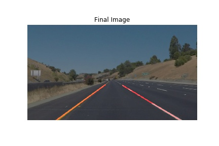
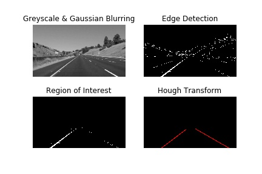

# Project-1: Lane Line Finding

***This repository contains the final code using the knowledge gained in the above tests combined together. If you see the results below, I combine all the images generated at each step and form the final filtered image. The results are for different images which have different lane colors and conditions.***

# Requirements

* Python 3 +
* Numpy
* Matplotlib
* OpenCV
* glob (optional)

# Results

**1. Image-1:**

* Input Image

* Image Processing Pipeline

* Final Output

**2. Image-2:**

* Input Image

* Image Processing Pipeline

* Final Output

 

**3. Image-3:**

* Input Image

* Image Processing Pipeline

* Final Output

**4. Image-4:**

* Input Image

* Image Processing Pipeline

* Final Output

 

**5. Image-5:**

* Input Image

* Image Processing Pipeline

* Final Output

**6. Image-6:**

* Input Image

* Image Processing Pipeline

* Final Output

 
