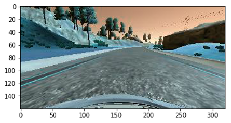
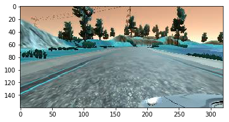
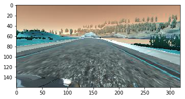

# Behaviorial Cloning Project

[](http://www.udacity.com/drive)

***This repository contains the code for Project - 3: Behaviorial Cloning in Udacity's SDCND. This repository contains the code and the complete pipeline used to make this project as well as the video of the car in simulator moving around in autonomous mode.***


# Requirements

* Python 3.5 or above
* Numpy
* Matplotlib
* OpenCV
* Tensorflow
* Keras
* GPU Access [Local/Google Cloud/AWS]

# Usage

Clone the project using the following command using Git Bash.

```
git clone https://github.com/anujdutt9/Self-Driving-Car-Nano-Degree.git
```

This will place the main folder in your current directory. The directory "Project-3 Behavioral Cloning" contains the complete project with code, trained model and the video output.

To run the code for training the model, use the following command from command line:

```
python model.py
```

This will save the trained model into your current working directory.

To run the code for driving the car in autonomous mode, use the following command from command line:

```
python drive.py model.h5
```

Make sure that the "drive.py" scipt and the trained saved model "model.h5" are in the same directory.


# Project Pipeline

The project is set up as follows:

```
Project-3: Behavioral Cloning
|_ data_preprocessing.py
|_ model.py
|_ drive.py
|_ model.h5
|_ video.py
|_ run1
|_ output.mp4
```

**1. data_preprocessing.py**

This file deals with the raw input data and processing it before it is fed into the main model. The preprocessing consists of the following steps:

**a). Load Data**

The data is collected using the training part in the simulator where we drive the car around the track and it collects the images from all three cameras along with the steering angle at each point of time in a csv file. So, to load the data, we read this csv file line by line that contains the steering angle along with the path of the center, left and right images.

**b). Load and Separate the data and apply Correction to Left and Right Image Steering Angle Values**

In this step we separate the center, left and right images and as per the suggestions in the lecture, we add a correction value of 0.2 to the left and right steering angle values.

|**Center Camera Image**|**Left Camera Image**|**Right Camera Image**|
| --------------------- | ------------------- | -------------------- |
||||

**c). Data Augmentation**

Since, the dataset we have is a bit small i.e. 20,000 images, so to collect more data there are two options: either drive on the track for long time or data augmentation. I followed the second approach.
To augment the data, I used flipping and random brightness variations in the input images. I also tried to use translation but that didn't worked very well with my model.

**d). Batch Data Generator**

This fucntion takes in the images and the batch size that we want for the model and gives out the images in batches. For this, I played around with the values of the batch size but finally settled on 32 as it worked fine.

**2. model.py**

This file contains the main model that needs to be trained on the images collected from training part of the simulator. The images collected are from 3 cameras i.e. Center, Left and Right. The aim of this model is to learn the image representations from all three cameras, along with the steering angle measurements and then later on predict the steering angle for the images streaming as input during the autonoous mode. The pipeline consists of the following steps:

**a). Load Total Images and Steering Angles**

This method fetches the total images and measurements from the 2nd function described above in data_preprocessing.py.

**b). Train Test Split**

Since, we don't want our model to overfit, we divide our data into training and validation set using scikit-learn and then provide this data to the model to train and validate.

**c). CNN Model**

For this, I followed, to some extent the NVIDIA's model from this paper[end to end learning for self-driving cars]. This model has the following architecture:

**Model Architecture**

```
Layer (type)                     Output Shape          Param #                          
=================================================================
lambda_1 (Lambda)                (None, 160, 320, 3)   0                      
_________________________________________________________________
cropping2d_1 (Cropping2D)        (None, 90, 320, 3)    0                            
_________________________________________________________________
convolution2d_1 (Convolution2D)  (None, 43, 158, 24)   1824                     
_________________________________________________________________
convolution2d_2 (Convolution2D)  (None, 20, 77, 36)    21636                 
_________________________________________________________________
convolution2d_3 (Convolution2D)  (None, 8, 37, 48)     43248                 
_________________________________________________________________
convolution2d_4 (Convolution2D)  (None, 6, 35, 64)     27712                 
_________________________________________________________________
convolution2d_5 (Convolution2D)  (None, 4, 33, 64)     36928                 
_________________________________________________________________
flatten_1 (Flatten)              (None, 8448)          0                     
_________________________________________________________________
dense_1 (Dense)                  (None, 100)           844900                      
_________________________________________________________________
dense_2 (Dense)                  (None, 50)            5050                          
_________________________________________________________________
dense_3 (Dense)                  (None, 10)            510                           
_________________________________________________________________
dense_4 (Dense)                  (None, 1)             11                            
=================================================================
Total params: 981,819
Trainable params: 981,819
Non-trainable params: 0
```

This model worked fine on the data that we had and at the end we got the saved model as "model.h5". To improve the performance, I also tried adding a Dropout layer before the Flatten layer as well as include L2/L1 Regularization to reduce amount of overfitting and improve the accuracy of the model.

Apart from that, I also tried to conver the images from RGB to YUV as stated in the NVIDIA paper but that didn't helped much.

**3. drive.py**

This file is provided by Udacity to run the trained model for the car in autonomous mode. I just changed the values for throttle till the point the output looked fine to me. For my case, I have changed the speed from 9 to 15.

**4. model.h5**

Trained model for the autonomous car.

**5. video.py**

This file is provided by udacity and helps record the video.

**6. run1**

This folder contains the images from the autonomous run of the car in the simulator.

**7. output.mp4**

This is the final video of the car driving in autonomous mode.

# Output Video

[](https://www.youtube.com/watch?v=goXeydMyGrI)

# Potential Shortcomings of Current Pipeline

The current pipeline has been only tested on Track 1 and not Track 2. Also, techniques like including shadow in images for data augmentation, gaussian blurring for more smooth images before processing, better CNN model to avoid overfitting like using Dropout, more data etc. is required. Also, currently this model is able to drive the car autonomouslly till the throttle is set to about 15. If I increase this value to max i.e. 30 or above 15, the car tries to move out of the path.

# Possible Improvements

Further training and model improvements in terms of better data augmentation like changing gamma values of images, applying gaussian blurr to smoothen the images before processing, shadow in images etc. is required to make the model robust. This will also improve the performance of the car at higher speeds.

# References

**1. Training Data:** Udacity Self Driving Car Simulator

**2. CNN Model:** NVIDIA Paper [https://arxiv.org/pdf/1604.07316.pdf]
